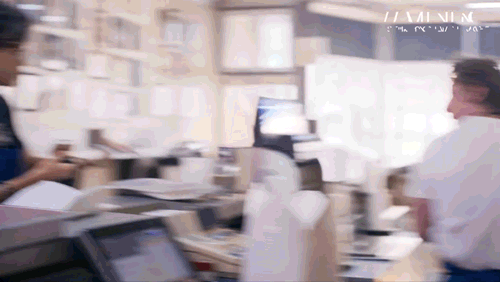
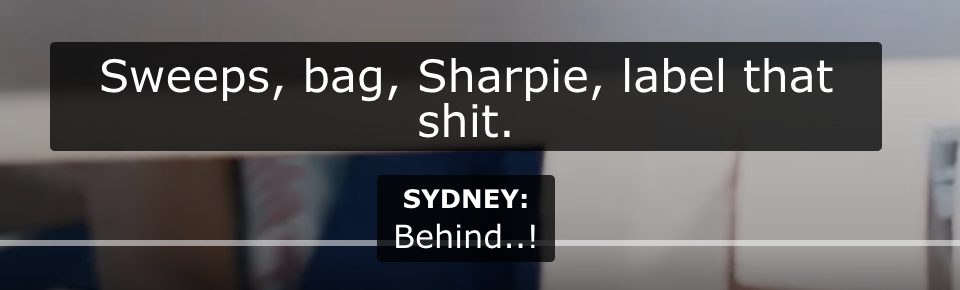
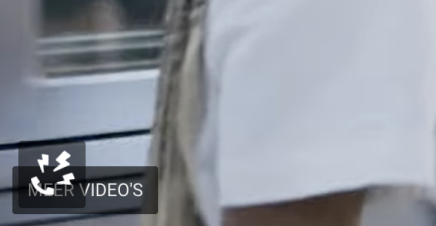

# Human Centered Design - Enhanced CCs

For the course "Human Centered Design" everyone was tasked to create an exclusive design for someone with a disability based on a problem that they are facing. Creating an exclusive design is a design philosophy that prioritizes inclusivity and accessibility by considering the needs and experiences of a single person.

The primary objective of this course is to focus on understanding the perspective of the person we will be designing for, what their wishes and needs are and how to translate this into a prototype solution. Through interviews and testing with said person, we will gather the information needed to create a solution that has specifically been designed for them and figure out if it meets their needs and wishes.

**The main learning goals of this course are:**
- Learn how to apply exclusive design principles
- Understand and use the needs of the person you're designing for
- Learn how to test and use the test results to improve your design

## Marie van Driessche

For my exclusive design I was paired with Marie van Driessche. Marie is Deaf (yes, with a capital letter D, indicating that she identifies herself as Deaf, which essentially means that her first language is Dutch Sign Language).

For Marie, watching a movie or a documentary results in a significant loss of nuance. While many films provide closed captions, they are often as neutral as possible and inaccurate when it comes to writing speech. My main goal was to think of a way to enrich closed captions to make them more meaningful for Marie.

During our first meeting and interview we got to know Marie a bit better as a person. She also shared with us her experiences and challenges about accessibility for those who are Deaf or hard of hearing.

## First meeting (test) with Marie

Before the others and I, who all got paired with Marie, dove into creating an exclusive design for her, we had a first initial meeting/interview with her! So, naturally we prepared some questions and discussed our assumptions related to the topic, Marie and the assignment itself. It was important for us to test the assumptions we had with Marie, to see which ones were accurate and which ones were not, and eventually learn new information about Marie herself!

One thing we were curious about was what the difference is between "deaf" and "Deaf". Marie explained the difference between "deaf" and "Deaf" from a medical and social perspective. "Deaf" with a capital D refers to a community and culture of individuals who are deaf and do not see it as a problem or disability, but rather embrace their identity. There are various ways people perceive their deafness, and while the medical perspective may view it as a disability, many in the Deaf community consider it as a normal part of who they are.

We discussed plenty of things during our first meeting with Marie, which can be read in [this document](https://docs.google.com/document/d/1LDvOvYqQnEArSfly82C-WOUW9OdvcDLzjdc0qaiFU7Q/edit?usp=sharing) (please know that I tried my best with the notes, but note taking is very difficult unfortunately... so there might be some silly words or emoticons in there!)

Due to the short amount of time we had to prepare for our first meeting, we we're unable to create a first prototype. However, because we discussed our assumptions and asked Marie to show us some 'good' closed captions examples, I say the first 'test' was successful! We received enough information/wishes from Marie to properly get started on our prototype and creating a user scenario!

## User Scenario
### So, who exactly is Marie?

Marie (34) is Deaf (and was born Deaf) and primarily communicates using Dutch Sign Language. She proudly introduced herself to us as a UX designer at UpInk (an innovative design agency in Amsterdam). UpInk is a digital agency with a focus on projects that have social impact. 

Marie lives in Amsterdam and shares her home with a beloved cat. She has a diverse range of other interests and hobbies, including kickboxing, crossfit, and kitesurfing! Marie also teaches kitesurfing to Deaf individuals, combining her passion for sports and inclusivity. Additionally, she enjoys cooking, especially baking cookies, and finds inspiration in reading cookbooks. Marie values spending time with friends, engaging in enjoyable activities, and has recently started a small course.

Growing up, she relied on sign language as her primary way of communication. Marie explained to us that she is unable to hear anything and relies on lip-reading, which can vary depending on the speaker's clarity, context, and visual cues. To facilitate communication during work meetings, Marie always has a sign language interpreter present, making it easier for her to follow discussions (sign language being her native language).

Besides her interests, she is passionate about watching movies and documentaries. However, she often finds it challenging to fully comprehend and enjoy the content due to the lack of accessibility for individuals who are Deaf or hard of hearing. This is where I come in to help!

### What does Marie need and why?

Marie explained to us that closed captions are usually available when she wants to watch a movie or documentary, but she knows from past experiences that they tend to be very basic and devoid of the subtleties that make the viewing experience truly engaging. She wants more enhanced captions, that would include additional information such as sound descriptions, emotional cues, and speaker identification to provide a more immersive experience.

Marie shared how these enhanced closed captions could greatly improve her movie-watching experience. With this enriched accessibility feature, she would be able to grasp the subtle nuances of dialogue, experience the emotional impact of scenes, and fully immerse herself in the storytelling.

### How will Marie have her needs met?

This isn't just like any other digital prototype that we've made for this Minor. Usually it's a website or app, but Marie is fully capable of utilizing the web and digital technologies just like any other individual! Our challenge is to create enhanced closed captions, which will be showed over a video. Instead of Marie needing to perform specific actions to achieve her goals/needs, it is up to us as designers to make sure our prototype **meets** her goals and needs.

Marie suggested we use visual representations or symbols for sound descriptions to convey the atmosphere or tone of a specific scene. She mentioned to us that sometimes movies or shows will "try too hard" with their closed captions; it is not always needed to describe the sound when it is happening on screen (example: explosion happening on screen!). She wants us to introduce speakers within the captions appropriately so she can follow the conversation more easily and understand who is speaking. Another thing Marie appreciates is when the closed captions are consistent and include an accurate representation of the speech or way something was said by a person on screen.

## Creating a prototype

After our meeting with Marie, I would get started on creating an actual prototype. I was kinda lost how to create a working prototype, since I had never worked with CC before. Thankfully a few of my friends had followed a course called "Visual Interface Design" previous semester. During said course, they apparently had to work on an assignment similar to this! Meaning they had some code I could look into and use for my very own implementation. The original implementation was created by Vasilis, but I used [Sasja Koning's repo](https://github.com/sasjakoning/web-typography-22-23).

Marie mentioned she recently watched a show on Disney called The Bear. She showed us a clip and explained to us how there's a lot going on, and that there's apparently a very tense/stressed atmosphere, however she didn't know about that until after she read episode reviews online! This convinced and inspired me to pick a clip from The Bear and try to enhance their CCs.

At first I was planning on using a VTT file (Web Video Text Tracks), which is a popular subtitle format used for displaying timed text captions in HTML5 videos. These files contain text-based captions that are synchronized by specific timestamps, allowing the captions to be displayed at the appropriate time during video playback. Alongside a `<video>` element, I tried using the `<track>` element to use the VTT file. Unfortunately you can not style the text from the VTT file. Therefore I decided to use the code from Vasilis and adjust it slightly so it could convert the VTT file to the captions I needed, meaning I would have the ability to style them as well.

Unfortunately this approach didn't work either, since I could not attach classes or emotions to the VTT file, so I created my own object containing the captions. This allowed me to get more creative and style things the way I wanted to!

```js
{
    vtt: "00:00:45.500 --> 00:00:46.190",
    start: "",
    end: "",
    text: [
        {
            speaker: "Camren",
            speech: "Chef!",
            emotion: "angry",
            text_type: "speech",
            text_class: "uppercase shouting",

        },
    ],
    cc_class: null
},
```

The next step was to actually watch the clip I chose and change the text of the CC to be more accurate. It was kind of weird to see how the CCs were not accurate at all. For example, the characters in the clip would say "imma head out", but then the CC would say "I'm going to head out". Gramatically, the CC would be correct and accurate, however that is not what the actor said! Those who do not have difficulty hearing are aware of how the character said it and how it was said, so you might not even notice the CC being a bit off sometimes. However for Marie, this means she doesn't catch that bit of a character!

Besides changing the text, I tried to add emotion where needed. For example: at various times throughout the clip you will hear characters shouting. This is usually displayed rather boringly or just in captilized text. However with anger or shouting, you can often hear how serious or aggressive the speech or tone is. So I tried by best to visualize the right tone, such as capitilizing text, increasing font weight or even adding a slam animation to indicate a loud shout/yell. I did the same with characters who are distant or sound soft, instead of making the text appear big, I decreased the font weight for those lines.





I also added a phone icon to indicate the constant ringing of the phone in the background. During the entire clip this ringing sound can be heard, which only adds to the already intense atmosphere, see below:



## First test
So, I created a pretty basic (in my opinion) closed caption prototype based on a scene from The Bear on YouTube. Before starting and going into the test with Marie and my group, I figured it would be best to establish a small test plan. I was mostly curious about whether or not the visual cue I made to indicate a phone ringing in the background, would be clear and even noticable for Marie. Does she even see or notice it? (she could be focusing on reading the text instead) And does she know what it means/what it is supposed to indicate? 

I also want to know if she can feel and grasp the tense atmosphere of the scene. It's a pretty chaotic and hectic scene, as she mentioned herself before, with lots of things going on (offscreen). At one point during the scene, two characters (Sydney and Marcus), end up arguing with each other about priorities. During this argument, both characters talk over each other. I have created several different ways (for now) to try and show that the two characters are doing so: 
- 'basic' captions that shows the speech of both characters underneath each other
- captions underneath each other but with an additional speech icon above the captions (with and without explanatory text)
- and finally a version where I placed the speech icon next to the names of the characters


As mentioned before, I also created a few effects for loud/shouting speeches that happen during the scene or characters that say something soft/from far away. So, I am also curious about what her thoughts are about this and if it conveys the emotion/tone/distance correctly for her. As for the context/scenario, she mentioned she mostly watches shows (and movies, but very rarely) at home on her TV, so for this test I would like her to imagine being at home and watching the scene on TV. 

**Summary of things I want to know:**
- Does Marie notice the visual cue on the bottom left side of the video?
- Does Marie understand what the visual cue tries to indicate?
- If Marie notices and understand the visual cue, does she find it helpful?
- Does Marie grasp the tense atmosphere of the scene? If not, what was missing or what was causing her to think otherwise?
- Does Marie understand that the two characters are talking over each other?
- Which version of the CC for characters talking over each other is the most helpful for Marie? Does she prefer a specific version or maybe neither?
- Do the style effects, such as animations or font sizing, convey the right emotion/tone/distance to Marie?

### Feedback from Marie

Before we conducted the second interview/test with Marie, my group and I sat together to discuss a way to approach the test. We all kind of created the same thing, however we also all implemented a unique feature within the prototype itself. But, because inheritly they were the same, we decided to group prototypes those prototypes together (test order), so they could receive feedback that would be valuable for others as well. And that way Marie doesn't have to switch between types of prototypes and can stay on a specific type and compare the versions we created. 

We started with 'regular' enhanced closed captions (including mine), moved onto enhanced closed captions that also incorporated haptic ? movement based on audio cues through the phone and ended the session with a prototype that focused on a podcast.

One of the main things Marie told us was that some of us, including myself, would still include the character names too often than needed. She told us that when you first see or hear the character, she appreciates it if we show the names of said character. Once they're introduced and continue talking for a bit, she does not need us show the names again (she already knows they're speaking!), even when she is not able to see them on screen.

- positioning text (x-axis)
- introduce visual cue, move it somewhere else (showed us funny examples)
- talking over each other -> different ways and which one she prefers
- audio cues based on how loud -> no time :sad:

## Final version

## Exclusive Design Principles and how I applied them

As mentioned before, exclusive design is a design philosophy that prioritizes inclusivity and accessibility by considering the needs and experiences of a single person, which in my case was Marie! Throughout this course I did my best to apply its principles: study situation, include prioritizing identity, ignoring conventions, and adding nonsense. Let's explore each principle in more detail and discuss how I ended up using them for my prototype:

### Study situation

### Prioritise identity
Exclusive design recognizes that individuals have unique identities, backgrounds, and preferences. It emphasizes the importance of understanding and accommodating diverse perspectives and needs. By considering the specific requirements and preferences of different user groups, designers can create inclusive solutions that resonate with a wider audience.

### Ignore conventions
Exclusive design challenges the notion of relying solely on established design conventions. Instead, it encourages designers to question existing norms and conventions that may unintentionally exclude certain users. By breaking away from conventional thinking, designers can explore innovative solutions that address accessibility barriers and create more inclusive experiences.

### Add nonsense
Adding nonsense refers to the concept of incorporating elements or features that might initially appear irrelevant or nonsensical. This approach prompts designers to think beyond typical design patterns and consider unconventional ways to address accessibility challenges. By introducing unexpected elements, designers can spark creativity, open up new possibilities, and discover unique solutions that enhance inclusivity.

