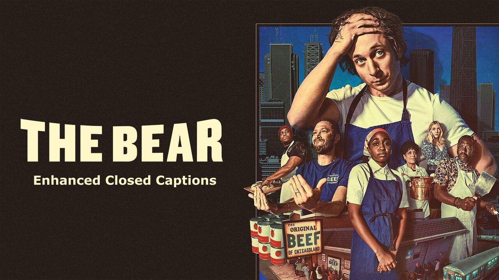

# Human Centered Design - Enhanced Closed Captions

For the course "Human Centered Design" everyone was tasked to create an exclusive design for someone with a disability based on a problem that they are facing. Creating an exclusive design is a design philosophy that prioritizes inclusivity and accessibility by considering the needs and experiences of a single person.

The primary objective of this course is to focus on understanding the perspective of the person we will be designing for, what their wishes and needs are and how to translate this into a prototype solution. Through interviews and testing with said person, we will gather the information needed to create a solution that has specifically been designed for them and figure out if it meets their needs and wishes.

**The main learning goals of this course are:**
- Learn how to apply exclusive design principles
- Understand and use the needs of the person you're designing for
- Learn how to test and use the test results to improve your design

## Research question

>  How do closed captions work for Marie? 

## Problem definition
For my exclusive design I was paired with Marie van Driessche. Marie is Deaf (yes, with a capital letter D, indicating that she identifies herself as Deaf, which essentially means that her first language is Dutch Sign Language).

For Marie, watching a movie or a documentary results in a significant loss of nuance. While many films provide closed captions, they are often as neutral as possible and inaccurate when it comes to writing speech. My main goal was to think of a way to enrich closed captions to make them more meaningful for Marie.

## Solution
My solution for Marie was to reimagine the closed captions for The Bear and try to enhance them to ensure Marie is able to fully immerse herself in the storytelling of the film or show she is watching. I accomplished (or at least tried my best to) this by implementing the following:

- Speaker identification where needed
- Accurate speech capture
- Visual cues for background noise
- Positioning of text to visually indicate speaker identification

## Link prototype

Click [here](https://noyamirai.github.io/thebear/) to view! (Please note that sometimes the video will not load. This is due to the Youtube Iframe API that sometimes refuses to work, a simple fix to this is to hard refresh the page `cmd + shift + R`. Another note: the phone ringing indicator might not always work either. Try pausing and playing the video, it might show up! Apologies for the bugs...)

## Documentation
Curious about the entire development and research process that resulted in the final prototype? Read a more detailed documentation [here](https://github.com/noyamirai/thebear/blob/main/docs.md)

